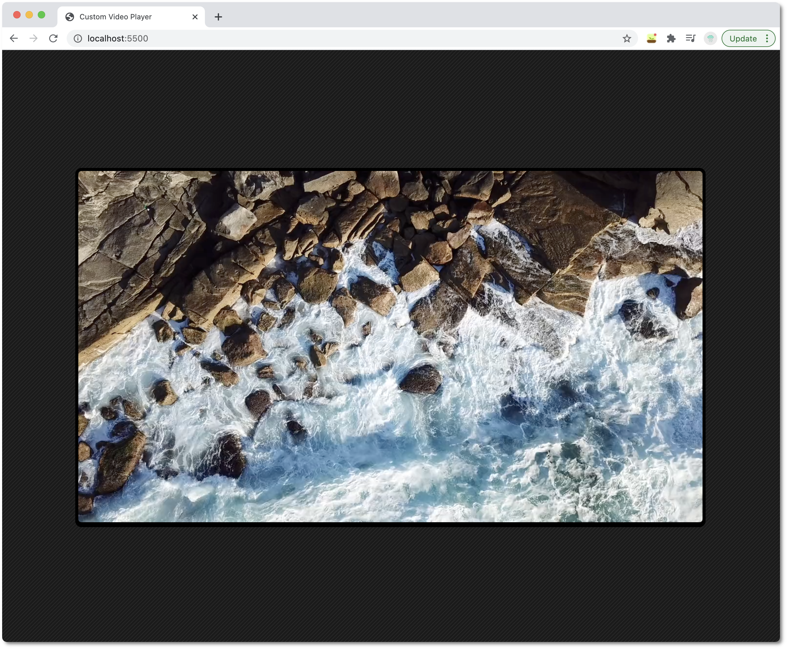

# Movie player

Movie player built with JavaScript, CSS & HTML. It has its own customised and styled controls.

---

## Features

- You can make the video fullscreen
- You can control the audio and the speed of the video
- You can play the video from any point from the progress bar

> Easily controlling the audio of the video.

> Different options for speed.

> Control the progress bar of the video.

